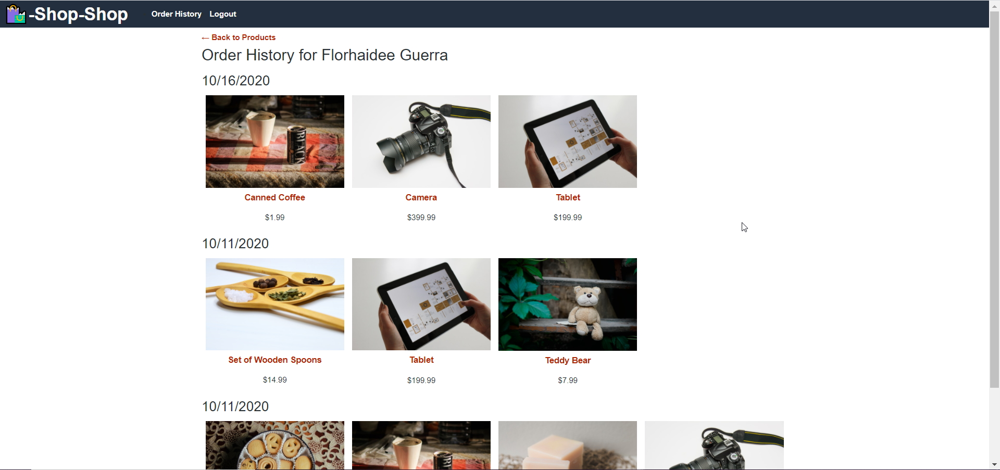

# SHOP-SHOP  [](code_of_conduct.md)
  An e-commerce platform that allows users to purchase

  ## Description 

  Shop-Shop is an e-commerce app built using React and, it was adapted to use Redux to manage state. Other of the main functionalities is the use of Stripe as a payment service and as offline functionality the use of IndexedDB.

  

  ## Table of Contents 
  * [Installation](#installation)
  * [Usage](#usage)
  * [License](#license)
  * [Contributing](#contributing)
  * [Questions](#questions)
  

  ## Installation

    1. Download or clone this repository on your computer.

   

    2. To install all dependencies:

        * Open your editor and type the following command into your terminal, once you've navigated to the root directory of the project
        ```
        npm init 
        ```
        * Install all the dependencies using npm
        ```
        npm install -y

        ```
        * To initialize the app go to command line and type:
        ```
        npm start

        ```

  ## Usage

    * Sign-up or Login: Use the Navigation bar 


    * Add a Product to the shopping cart: Can be done from the main page or on the single product page how shows next image:


    * Shopping Cart: is on the top-right on the Navigation bar:


    * To place and order the user must be login to take them to the checkout page:


    * Order History: User must be login to see their Order history page:




  ## License

    Copyright © 2020 florhaidee. 
    Licensed under the MIT to see more about this license you can find it on the file 'license.txt' go to [MIT-license](LICENSE)


  ## Contributing 

    Please note that this project is released with a Contributor Code of Conduct. By participating in this project you agree to abide by its terms.
    Visit:
https://www.contributor-covenant.org/version/2/0/code_of_conduct/ to have more information.

    To contribute 
     * Add an issue
     * Create a new branch with format-name: 
        - (feature/name/your-name) or (bug/name/your-name) 
     * Make a pull request.


  ## Questions

    If you have more questions about this application, you can contact me by:
      email: florhaideeg@gmail.com
      GitHub username: florhaidee


  ## ©️2020  Made  by florhaidee
